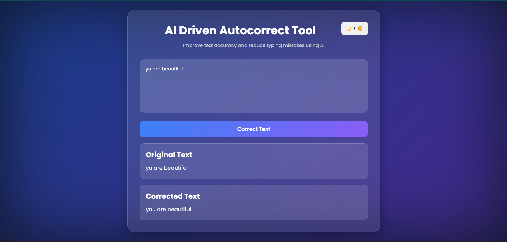

# AI Driven Autocorrect Tool

## Overview

AI Driven Autocorrect Tool is a web-based application developed using Python and Flask that helps users improve text accuracy by automatically correcting spelling mistakes. The tool provides a simple and user-friendly interface where users can enter text and receive corrected output instantly.

## Features

* Automatic spelling correction
* Modern and responsive user interface
* Dark/Light mode toggle
* Displays original and corrected text
* Built using Flask and TextBlob
* Easy to use and lightweight

## Technologies Used

* Python
* Flask
* HTML
* CSS
* JavaScript
* TextBlob

## Project Structure

AI_AUTOCORRECT_TOOL/

├── app.py

├── templates/

│ └── index.html

├── static/

│ └── style.css

└── README.md

## Installation

1. Clone the repository:

git clone <repository-url>

2. Navigate to the project folder:

cd AI_AUTOCORRECT_TOOL

3. Install required packages:

pip install flask textblob

4. Download TextBlob corpora:

python -m textblob.download_corpora

## Running the Application

Run the following command:

python app.py

Open your browser and visit:

http://127.0.0.1:5000

## How It Works

1. User enters text in the input area.
2. The text is sent to the Flask backend.
3. TextBlob analyzes the text and detects spelling mistakes.
4. Corrected text is generated.
5. The original and corrected text are displayed to the user.

## Sample Input

I am goin to collge tomorow

## Sample Output

I am going to college tomorrow

## 📸 Screenshot

## Future Enhancements

* Grammar correction
* Voice input support
* Real-time correction while typing
* Multi-language support
* AI-powered sentence improvement

## Author

Sanjay Kumar Sahoo

## License

This project is developed for educational and learning purposes.
